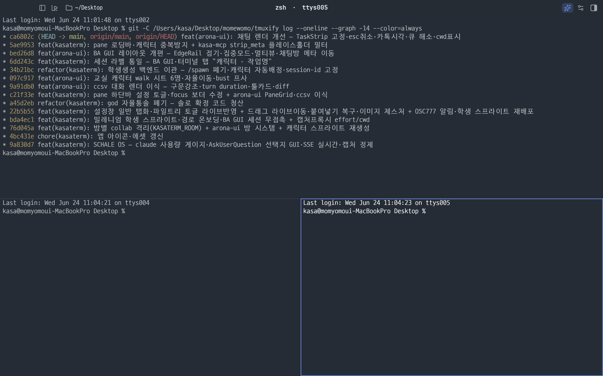

<div align="center">


# kasaterm

**Rust로 바닥부터 만든 크로스플랫폼 GPU 터미널.**

셀 렌더러 · 한글 IME · PTY를 기성 라이브러리 없이 자체 crate로 구현했고,<br/>
그 위에 **여러 Claude를 학생처럼 거느리는 GUI**를 얹었다.

[데모](#데모) · [강점](#강점--전부-자체-구현했다) · [crate](#재사용-가능한-crate) · [설치](#설치--실행) · [단축키](#단축키) · [구조](#구조)


[](https://github.com/2rami/kasaterm/stargazers)
[](https://github.com/sponsors/2rami)

</div>

---

## 데모

<div align="center">
  
  <br/>
  <sub>GUI 버튼·드래그로 나눈 멀티페인. tmux prefix 키 없이 분할하고, 한글·색·box-drawing이 자체 렌더러로 그려진다.</sub>
</div>

---

## 이게 뭐야

자체 제작 GUI 터미널이다. tmux를 prefix 키 대신 **GUI 버튼·드래그·자연어**로 다루는 네이티브 Rust 앱이고, 렌더러·한글 IME·PTY까지 **기성 터미널 라이브러리에 기대지 않고 전부 직접 만들었다.**

두 축으로 읽으면 된다:

- **아래 — 터미널 엔진.** wgpu 셀 렌더러, 두벌식 한글 IME, 크로스플랫폼 PTY를 각각 **독립 crate**로 깎았다. 터미널을 만들려는 사람이 부품만 가져다 쓸 수 있게 설계했다.
- **위 — AI 오케스트레이션.** 그 엔진 위에서, pane마다 도는 Claude의 작업이 BA GUI(아로나 모드)로 실시간으로 보인다. 로그를 읽는 게 아니라 작업을 *지켜본다.*

---

## 강점 — 전부 자체 구현했다

기성 라이브러리를 붙인 게 아니라, 터미널의 핵심 부품을 바닥부터 만들었다.

| | 무엇 | crate |
|---|---|---|
| **GPU 셀 렌더** | swash atlas에 글리프를 한 번 굽고 셀당 인스턴스 1개로 그린다. box-drawing은 wgpu quad, CJK·이모지 fallback 내장 | `kasa-cells` |
| **한글 IME** | OS IME에 의존하지 않는 두벌식 입력 오토마타. 복합 종성까지 자체 조합 | `kasa-ime` |
| **크로스플랫폼 PTY** | `portable-pty` + `alacritty_terminal`. macOS·Linux BSD PTY와 Windows ConPTY가 **동일 코드 경로** | `kasa-pty` |
| **색재현** | shader sRGB→DisplayP3 변환 + root `CAMetalLayer`. 터미널 색이 디자인 의도대로 (sugarloaf/ghostty 동급) | `kasa-cells` |

### 크로스플랫폼

macOS·Windows·Linux를 같은 코드로 굴린다. PTY는 `portable-pty`로 추상화해 Windows에서는 ConPTY, 그 외에서는 BSD PTY로 자동 분기한다 — 플랫폼별 백엔드 분기 없이 동일 경로. macOS `.app`, Windows `.msi` 번들을 빌드 스크립트로 굽는다.

### 재사용 가능한 crate

워크스페이스가 곧 부품 카탈로그다. 각 crate는 kasaterm 없이도 독립적으로 쓸 수 있게 경계를 잡았다 — 특히 `kasa-cells`는 프레임워크 중립이라 `alacritty_terminal`·`wezterm-term` 같은 터미널 상태머신과 짝지어 **다른 터미널을 만드는 데 그대로 가져다 쓸 수 있다.**

| crate | 한 줄 | 독립 사용 |
|---|---|---|
| **`kasa-cells`** | 프레임워크 중립 GPU 셀 렌더러 (wgpu). swash atlas·sRGB→P3·box-drawing·Nerd 폰트 번들 | 터미널/그리드 UI 제작용 |
| **`kasa-pty`** | PTY + `alacritty_terminal` 백엔드. 크로스플랫폼(ConPTY 포함) | 헤드리스 PTY 호스트 |
| **`kasa-ime`** | 두벌식 한글 입력 오토마타. OS IME 비의존 | 한글 입력이 필요한 Rust 앱 |
| **`kasa-socket`** | cmux 호환 Unix-socket JSON-RPC 서버. `kasaterm-cli` 포함 | pane 제어 프로토콜 |
| **`kasa-mcp`** | pane 제어를 모델 도구로 노출하는 streamable-HTTP MCP 서버 | Claude/Antigravity 연동 |
| `app/kasaterm` | 메인 바이너리 — winit+wgpu 윈도우, chrome UI, 입력·단축키 라우팅 | — |

---

## 그 위 — 여러 Claude를 거느린다

엔진이 안정될수록 그 위에 쌓는 게 본 게임이다. pane마다 Claude Code를 띄우고, 각 학생(pane)이 무슨 작업을 하는지 BA GUI로 한눈에 본다.

<div align="center">
  
  <br/>
  <sub>왼쪽 교실에 학생(pane)들이, 가운데 각 학생의 대화·작업이, 오른쪽 Command Center에 현재 작업이 실시간으로.</sub>
</div>

다른 터미널과 다른 점:

- **작업이 굴러가는 걸 본다** — pane에서 Claude가 하는 일이 채팅·작업 트리로 실시간 표시된다.
- **pane끼리 연동된다** — pane이 격리된 창이 아니라, 에이전트가 pane을 넘나들며 협업하는 하나의 작업 공간이다.

### claude를 켜면 화면에 학생이 산다

pane에서 `claude`를 실행하면 그 pane에 블루 아카이브 학생 한 명이 배정된다 — 이름·테두리색·프로필이 전부 그 학생으로 맞춰지고, 창 전체에서 겹치지 않게 자동으로 고른다. `/rename 미도리`처럼 이름을 바꾸면 원하는 학생으로 갈아끼운다. (12명 로스터: 아로나·프라나·미도리·모모이·유즈·아리스·유우카·시로코·호시노·코하루·히마리·아루.)

그리고 kasaterm은 **Claude Code가 그리는 터미널 화면 자체**를 렌더 단계에서 읽어, 그 위에 배정된 학생을 그린다. 로그를 파싱하거나 별도로 통합한 게 아니라 — 화면만 보고 동작한다:

- **시작 배너** → Claude Code의 Clawd 블록아트를 감지해 학생 도트 idle 애니메이션으로 교체
- **statusline** → 모델·컨텍스트 옆에 학생 프로필(bust)을 2행으로
- **입력창 위** → 대기 중엔 학생이 전신으로 서서 숨쉬고(idle 애니), effort 칩이 뜨면 옆으로 비켜선다
- **작업 중** → 스피너 자리에서 학생이 걸어다닌다(walk)

로그를 읽는 게 아니라 학생이 옆에서 같이 일하는 것처럼 보인다.

<div align="center">
  
  <br/>
  <sub><code>claude</code> 로 대화하는 중 — 배정된 <b>아루</b>가 <b>시작 배너</b>(좌상) · <b>작업 스피너 옆 전신</b>(좌하) · <b>statusline 프로필</b>(최하단)에 동시에 나타난다. 작업 중일 땐 effort 칩을 피해 옆으로 비켜선다.</sub>
</div>

한 모노레포에 세 층이 쌓여 있고, 아래층이 위층을 떠받친다:

| 층 | 코드네임 | 역할 | 상태 |
|---|---|---|---|
| ① 엔진 | **kasaterm** | 터미널 — wgpu 셀 렌더 · PTY · 한글 IME · multipane | 거의 안정 |
| ② 작업환경 | **kasaspace** | 파일트리 · git 관리 · pane 간 에이전트 연결 | 진행 중 |
| ③ 오케스트레이션 | **blueclaudearchive** | 여러 Claude를 학생처럼 거느리는 하네스 GUI (아로나 모드) | 무게중심 |

---

## 설치 & 실행

```bash
# 개발 빌드
cargo run -p kasaterm

# 체감(스크롤·입력 지연) 테스트는 반드시 release — 디버그는 원래 버벅임
cargo run --release -p kasaterm
```

macOS `.app` / Windows `.msi` 번들은 별도 스크립트로 빌드한다(아이콘·codesign·설치 포함). 앱을 실행하면 pane 제어 CLI(`kasaterm-cli`)와 MCP 서버가 함께 뜨고, MCP는 Claude Code/Antigravity 설정에 자동 등록된다.

### Claude Code 플러그인 (kasapane 스킬)

멀티 pane 제어·협업·긴 잡 사이클·UI 자체검증 워크플로우를 Claude Code 스킬로 묶었다:

```bash
claude plugin marketplace add 2rami/kasaterm
claude plugin install kasapane@kasaterm
```

설치 후 `/kasapane`으로 호출한다. 스킬이 쓰는 `kasaterm-cli`·MCP는 앱 빌드에 내장돼 있다.

---

## 단축키

macOS는 `Cmd`, Windows/Linux는 `Ctrl+Shift`를 "호스트 modifier"로 쓴다 (Ctrl+letter는 셸로 흘려보내기 위함). 폰트 zoom만 Windows/Linux에서 `Ctrl` 단독.

<details>
<summary><b>pane 조작 · 크기/폰트 · 윈도우 단축키 (펼치기)</b></summary>

### pane 조작

| 동작 | macOS | Windows / Linux |
|---|---|---|
| 가로 분할 (위아래로 쌓기) | `Cmd + D` | `Ctrl + Shift + D` |
| 세로 분할 (좌우로 나누기) | `Cmd + Shift + D` 또는 `Cmd + E` | `Ctrl + Shift + E` |
| 포커스된 pane 닫기 | `Cmd + W` | `Ctrl + Shift + W` |
| pane 포커스 순환 | `Cmd + [` / `Cmd + ]` | `Ctrl + Shift + [` / `]` |
| 방향 쪽 pane으로 포커스 이동 | `Cmd + Option + 방향키` | `Ctrl + Shift + Alt + 방향키` |
| 두 pane 위치 맞바꾸기(swap) | `Cmd + Option + Shift + 방향키` | (동일 패턴) |

### 크기 / 폰트

| 동작 | macOS | Windows / Linux |
|---|---|---|
| 전체 UI 확대 / 축소 / 리셋 | `Cmd + =` / `Cmd + -` / `Cmd + 0` | `Ctrl + =` / `Ctrl + -` / `Ctrl + 0` |
| 포커스된 pane만 폰트 확대 / 축소 / 리셋 | `Cmd + Shift + =` / `Cmd + Shift + -` / `Cmd + Shift + 0` | `Ctrl + Alt + =` / `Ctrl + Alt + -` / `Ctrl + Alt + 0` |

pane 사이 비율 조절은 **경계선(divider) 마우스 드래그**, pane을 끌어 합치거나 나누는 건 **drag → merge/split 존**으로 한다 (키보드 단축키 없음).

### 윈도우 / 셸 입력 보조

| 동작 | 키 |
|---|---|
| 새 윈도우 (PTY 백엔드) | `Cmd + T` |
| 윈도우 1~9 전환 | `Cmd + 1` ~ `Cmd + 9` |
| 자동완성 suggestion 수락 | `→` / `End` / `Ctrl + E` |
| suggestion 단어 단위 수락 | `Alt(Option) + F` |
| 단어 단위 삭제 | `Alt(Option) + Backspace` |

</details>

---

## 구조

<details>
<summary><b>렌더러 env · MCP 도구 (펼치기)</b></summary>

워크스페이스 멤버는 [강점 — 재사용 가능한 crate](#재사용-가능한-crate) 표 참고. `spikes/*`는 iced/egui/gpui/warpui 등 채택 안 된 GUI 프레임워크 PoC다.

### 렌더러 / 환경 변수

기본 렌더러는 cell-renderer(`gpu.rs`) + P3. 주요 env 토글:

| 변수 | 효과 |
|---|---|
| `KASATERM_P3_ROOT=0` | P3 root-layer 경로 끄고 옛 sRGB sublayer 폴백 |
| `KASATERM_TEXT_GAMMA` / `_CONTRAST` / `_COLOR_SAT` | 텍스트 감마·대비·채도 노브 |
| `KASATERM_AUTOSPLIT` / `_MS` | N초 후 자동 분할 (`"vh"` 등, 헤드리스 검증용) |
| `KASATERM_AUTOCAPTURE_MS` / `_PATH` | N초 후 자동 스크린샷 (자체 테스트용) |
| `KASATERM_AUTOSEND` / `_MS` | N초 후 키 자동 전송 (자체 테스트용) |

### MCP 서버 도구

`crates/kasa-mcp`가 띄우는 streamable-HTTP MCP 서버로, Claude가 pane을 직접 제어한다. 앱이 부팅하면 자동으로 켜지고 Claude Code/Antigravity 설정에 자동 등록된다(별도 빌드·설치 불필요).

`kasaspace_list` · `kasaspace_split` · `kasaspace_close` · `kasaspace_focus` · `kasaspace_swap` · `kasaspace_rename` · `kasaspace_set_color` · `kasaspace_send` · `kasaspace_send_key` · `kasaspace_run_job` · `kasaspace_switch_window` · `kasaspace_workspace_list` · `kasaspace_workspace_current`

</details>

---

## 로드맵

세 층이 같이 진화 중이다. 아래층이 안정될수록 위층을 더 단단히 떠받친다.

| 층 | 항목 | 상태 |
|---|---|---|
| ① 엔진 | wgpu 셀 렌더 · P3 색재현 | 안정 |
| ① 엔진 | 두벌식 한글 IME (OS 비의존) | 안정 |
| ① 엔진 | 크로스플랫폼 PTY (macOS · Windows · Linux) | 안정 |
| ① 엔진 | `claude --resume` 세션 복원 | 예정 |
| ② 작업환경 | 파일트리 · git 패널 | 진행 중 |
| ② 작업환경 | pane 간 에이전트 연결 | 진행 중 |
| ③ 오케스트레이션 | BA GUI — 작업 실시간 시각화 | 진행 중 |
| ③ 오케스트레이션 | 여러 Claude 협업 (아로나 모드) | 진행 중 |

---

## 왜 만들었나

tmux로 Claude Code 팀모드를 굴리다 시작됐다. 여러 에이전트를 한 화면에 띄워 쓰다 보니, "작업할 때만이 아니라 평소에도 에이전트끼리 소통하면 어떨까" 싶었다.

마침 불편한 게 겹쳤다. ghostty 같은 GPU 터미널은 쾌적한데 윈도우엔 마땅한 게 없었고, 터미널 안에서 여러 에이전트가 무슨 작업을 하는지는 로그를 헤집어야 보였다. 그래서 세 가지를 한 번에 풀기로 했다 — **플랫폼에 묶이지 않는 GPU 터미널**, 그 위에 올린 **나만의 하네스**, 그리고 **작업이 굴러가는 걸 한눈에 보여주는 UI**.

기성 라이브러리에 기대지 않고 직접 만들고 싶었다. 디자이너로 일하다 개발에 입문한 터라, 터미널이 정보를 보여주는 방식 자체가 늘 답답했던 것도 있다. GPU 셀 렌더러(P3 색재현), 두벌식 한글 IME(OS IME 비의존), 크로스플랫폼 PTY까지 전부 자체 구현했고, 그 과정에서 깎인 부품들을 누구나 가져다 쓸 수 있는 crate로 남겼다. 결과물보다 만들면서 배운 게 더 컸다.

무료로 공개한다. 누군가에게 쓸모가 되거나, 같은 길을 걷는 사람에게 참고가 되면 충분하다.

---

## 후원

혼자 만드는 프로젝트입니다. 쓸모가 있었다면 후원으로 응원해주세요.

[](https://github.com/sponsors/2rami)

## 라이선스

[MIT](LICENSE)
